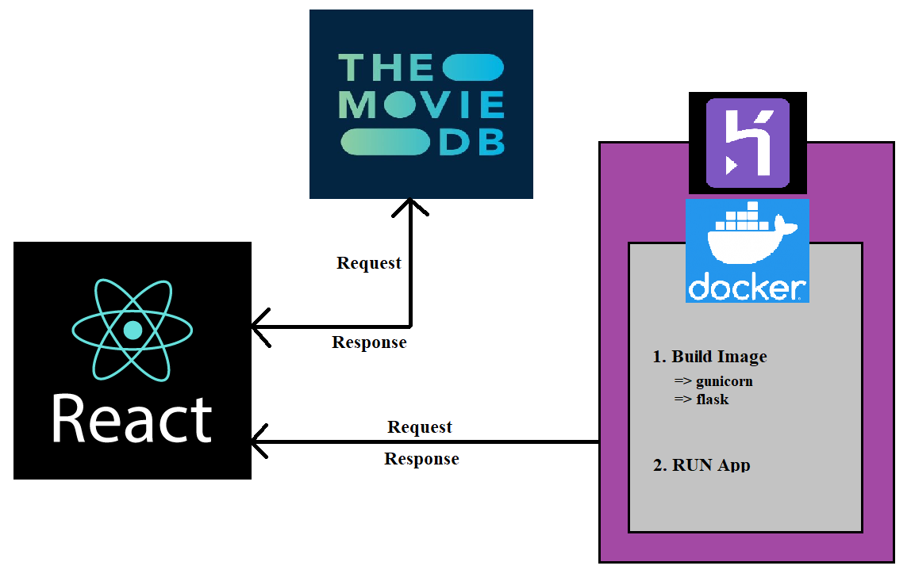

<div align="center">

<h1>Movie Recomendation System with Sentiment Analysis</h1>


</div>

## About

<b>Epic Movie Zone</b> is an AI based web application in which you can search for any Hollywood Movie. This application will provide all the information related to that movie, does <b>sentiment analysis</b> on the movie reviews and the most interesting part, this application will provide you the top 15 <b>movie recommendations</b> based on your search. Also it fetches the data of <b>Popular/Up-coming/Top-rated Movies </b>from The Movie-Database through API. (As we are fetching the latest data so it may/may not bo present in the dataset we used, in case of absence it will pop-up as "This data is not in our database") <br/>Also it tracks the activiity of user in browser, it adds the movies watched by user into the <b> Local Storage </b>so that next time when user visits the site, if fetches the data from Local storage & shows to User and provided movie-suggessions based on previously watched movie.<br/>
Also It provides <b>User-Authentication through Google & Facebook</b>, Every time user logs into the site it adds the data to firebase Database.

<b>ReactJS</b> is used for frontend which is deployed using <b>Firebase</b> and a <b>Flask API</b>is deployed using <b>Docker</b> container on <b>Heroku</b> to serve the machine learning models to the Frontend.

This application uses <b>Content Based Movie Recommendation (Through Cosine Similiarity Matrix)</b> to recommend movies to the user.<b>TMDB</b> API is used to retrieve all the information related to the movie and its cast. <b>Web Scraping</b> was done on <b>IMDB</b> website to get the reviews related to the searched movie. Sentiments analysis is done using a machine learning model trained on a sample of IMDB Dataset.<br/>

<b>Deployed Web Application Link: </b>https://movie-recommender-system-3408e.web.app/<br/>
<b>Deployed Flask API Link: </b>https://epic-mrs-api.herokuapp.com/<br/>
<b>Youtube Demo Link: </b>https://www.youtube.com/watch?v=O6cX2WNxVBc

## Demo

<div align="center">

</div>

## Architecture

<div align="center">

</div>

## How to generate TMDB API Key?

1. Login to you your tmdb account: https://www.themoviedb.org/ or create one if you dont have.
2. Then open https://www.themoviedb.org/settings/api link and create your api key by filing all the necessary information.
3. <b>IMPORTANT:</b> After generating the TMDB API KEY, replace "ENTER YOUR TMDB_API_KEY" with your generated key in the server directory (app.py File) and client (src->utils.js) code.

## TMDB API End Points

1. BASE URL: https://api.themoviedb.org/3
2. FOR MOVIE DATA: https://api.themoviedb.org/3/movie/{tmdb_movie_id}?api_key={TMDB_API_KEY}
3. FOR MOVIE CAST DATA: https://api.themoviedb.org/3/movie/{tmdb_movie_id}/credits?api_key={TMDB_API_KEY}
   <b>NOTE: </b>Please do refer the documentation at the BASE URL for better understanding.
4. For Trending DATA: https://api.themoviedb.org/3/movie/popular?api_key=${TMDB_API_KEY}
5. For Top-Rated DATA: https://api.themoviedb.org/3/movie/top_rated?api_key=${TMDB_API_KEY}
6. For Up-coming DATA: https://api.themoviedb.org/3/movie/upcoming?api_key=${TMDB_API_KEY}

## Flask API end points

1. To get recommendations: https://epic-mrs-api.herokuapp.com/recommend_movie

```
Data to be sent in POST request:
{
    movie_name:"The Avengers",
    number_of_recommendations:"15"
}

Data Returned by the API in JSON format:
{
    input_movie:{
        movie_id:TMDB_MOVIE_ID
    },
    recommendations:[
        {
            rank:1,
            movie_id:TMDB_MOVIE_ID
        },
        {
            rank:2,
            movie_id:TMDB_MOVIE_ID
        },
        .
        .
        .
    ]
}
```

2. To get Movie Reviews with Sentiments: https://epic-mrs-api.herokuapp.com/movie_reviews_sentiment

```
Data to be sent in POST request:
{
    movie_imdb_id:"MOVIE_IMDB_ID"
}

Data Returned by the API in JSON format:
[
    {
        id: 1,
        content: "THE REVIEW",
        sentiment: "SENTIMENT FOR THE REVIEW"
    },
    {
        id: 2,
        content: "THE REVIEW",
        sentiment: "SENTIMENT FOR THE REVIEW"
    },
    .
    .
    .
    10
]
```

<b>NOTE: </b>The error messages are returned in the following format:

```
{
    error:"Content of ERROR Message"
}
```

## Steps to run the React Project

1. Clone or download the repository in your local machine.
2. Open command prompt in the following folder `client`
3. Install all the npm packages

```
npm install
```

4. Since the Flask API is already deployed on Heroku no need to run the Flask API in your local machine to start the React frontend. You can start the react application using the following command: 
```
npm start
```

## Steps to run the Flask API

1. Clone or download the repository and open command prompt in `server` folder.

2. Install all the dependencies

```
pip install -r requirements.txt
```

3. Run the app.py file

```
python app.py
```

The API will be running at http://127.0.0.1:5000/

<b>NOTE: </b>You can run the Flask API and the React Frontend in parallel and can use for development by replacing the baseURL, present in `client/src/api/recommenderapi.js`, with the Flask API running link.

## Steps to run the Jupiter Notebooks
<b>NOTE: </b> you need to download the following datasets from the given links and need to add them `recommendation-engine-notebooks/data` directory to be accessible for notebooks 
<b>NOTE: </b> python 3.8 or earlier (i used python 3.7.3 to get tmdbv3 api package)


1. [movies_metadata_2016](https://www.kaggle.com/datasets/carolzhangdc/imdb-5000-movie-dataset)
2. [credits_2017](https://www.kaggle.com/datasets/rounakbanik/the-movies-dataset)
3. [movies_metadata_2017](https://www.kaggle.com/datasets/rounakbanik/the-movies-dataset)
4. [Clean and Lemmatized Dataset]( https://drive.google.com/file/d/1zpb4709VKuis6qQIN2TjE4zfYyS7IVVE/view?usp=sharing)
5. [IMDB 50k Movie reviews to create clean& lemmatized dataset](https://www.kaggle.com/datasets/lakshmi25npathi/imdb-dataset-of-50k-movie-reviews)
6. Remaining Datasets are generated using `MovieRecommendationDatasetPreparation.ipynb` in `MovieRecommendationCodes folder`

## Steps to Dockerize and Deploy the Flask API on Heroku

1. Clone or download the repository and open command prompt in `server` folder.
2. Create your docker account at https://hub.docker.com
3. Download the docker desktop based on you windows version from the official website of Dockers and login to the docker desktop.
4. Start the Docker desktop in you machine.
5. The Dockerfile for dockerinzing this Flask API is already present in the Server folder.
6. Open command prompt in API folder and run the below mentioned commands:
7. Building the Image:

```
docker build -t ENTER_YOUR_OWN_TAG_NAME .
```

It will take some time for the execution of the above command. After execution of the above command you can see the docker image details using the following command:

```
docker images
```

8. Install Heroku CLI in your local machine.
9. Login to your account using follwing command:

```
heroku login
```

10. Run the following commands for deplyment. Logging into heroku container:

```
heroku container:login
```

11. Create a app in heroku:

```
heroku create YOUR_APP_NAME
```

11. Pushing the docker image into heroku:

```
heroku container:push web --app YOUR_APP_NAME
```

12. Releasing the web app:

```
heroku container:release web --app YOUR_APP_NAME
```

That's it, you can see your API running at `https://YOUR_APP_NAME.herokuapp.com/`


## Steps to Deploy the React-App on FireBase

1. open the command-prompt in `client`

2. Run the following command, this will make a build folder in `client` directory, use this as root folder later for deployment

```
npm run build
```

3. Install the firebase CLI

```
npm install -g firebase-tools
```

4. Initialize the project

```
firebase login
firebase init
```

5. Deploy the project

```
firebase deploy
```

## Tech Stack Used

<div align="center">

<table>
    <tr>
        <td></td>
        <td></td>
        <td></td>
    </tr>
    <tr>
        <td></td>
        <td></td>
        <td></td>
    </tr>
</table>

</div>

## Referred Article Links

For Movie Recommendation System

1. [Article 1](https://towardsdatascience.com/how-to-build-from-scratch-a-content-based-movie-recommender-with-natural-language-processing-25ad400eb243)
2. [Article 2](https://analyticsindiamag.com/how-to-build-a-content-based-movie-recommendation-system-in-python/)

For Deployment Using Dockers

1. [Article 1](https://medium.com/analytics-vidhya/dockerize-your-python-flask-application-and-deploy-it-onto-heroku-650b7a605cc9)
2. [Article 2](https://pythonise.com/series/learning-flask/building-a-flask-app-with-docker-compose)
3. [Article 3](https://betterprogramming.pub/create-a-running-docker-container-with-gunicorn-and-flask-dcd98fddb8e0)
4. [Article 4](https://itnext.io/setup-flask-project-using-docker-and-gunicorn-4dcaaa829620)
5. [Article 5](https://philchen.com/2019/07/09/a-scalable-flask-application-using-gunicorn-on-ubuntu-18-04-in-docker)


<div align="center">
<b>Please do ⭐ this repo if you liked.</b>
</div>
